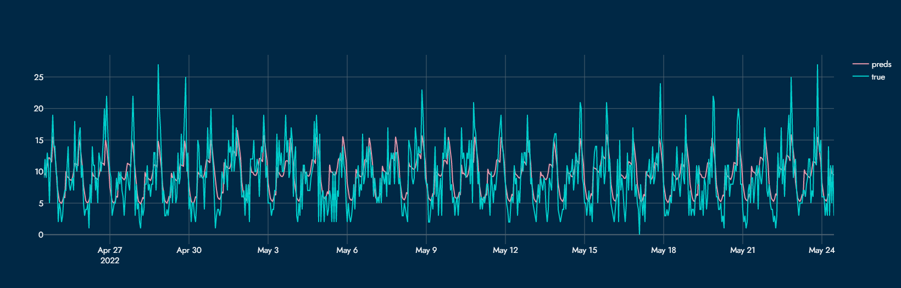

**Кратко**:

Это решение задачи хакатона в рамках Цифрового прорыва по созданию системы, предсказывающей нагрузку на скорую помощь. В своем решении мы пробовали множество разных подходов и моделей - их можно посмотреть в ноутбуке experiment.ipynb. Отдельно у нас есть код обучения лучшей модели вместе с EDA - train-best-notebook.ipynb

**Реализация в виде web-сервиса**:

В нашем сервисе ключевым элементов является карта частотности вызовов для каждого района, где в свою очередь можно увидеть точную загруженность для каждой конкретной подстанции. Мы предоставляем почасовые предсказания загруженности, основываясь на временных данных, а также на календарной информации. Так как при вызове скорой важна каждая минута, мы используем метрику RMSE для того, чтобы максимально штрафовать модель за каждую ошибку. 

**Уникальность**:

Кроме общей карты, мы даем возможность оценить на основании чего было предсказано значение загруженности подстанции, так что при нажатии на определенный адрес, оператор получает понятный график для оценки того, какие параметры повлияли на значение в этот конкретный час. Также мы даем полную по всем станциям, чтобы можно было оценить общую загруженность систему в Нижегородской области. Наше решение легко масштабируется, обладает минимальной прогрешностью, а также отличается невероятной скоростью работы.

**Стек технологий**:

Сравнение Catboost, Prophet, LightAutoML, NNProphet, Dash для создания веб интерфейса Openstreetmap для создание density maps на картах Dash + Plotly для веб-интерфейса и визуализации. Используется OpenStreetMap для отрисовки на тайловых картах.SHAP для визуализации влияния различных параметров на предсказания

*Ниже представлен почасовой график наших предсказаний на май 2022 года и реальные значения за этот же период*

